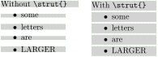

# Strut Prepender

## What it does

This ipelet prepends `\strut{}` to every text-box in the selection that does not start with `\strut{}`.

## Why

If you want to have equally spaced text boxes (for example in a presentation) the align ipelet is lacking.  It uses the outlines of the selected textboxes, which can be too large or small depending on the content.

After inserting struts in each text box, the outlines do not depend on the content anymore and it becomes easier to align them.

Example with outlines of text boxes outlined:

